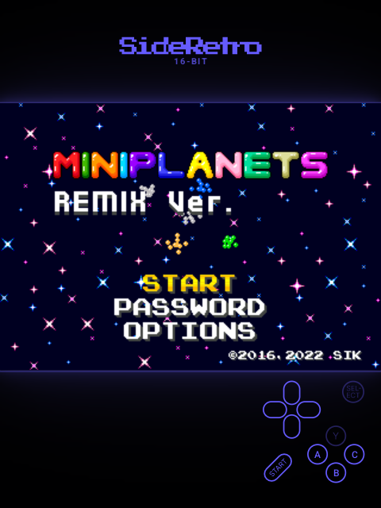
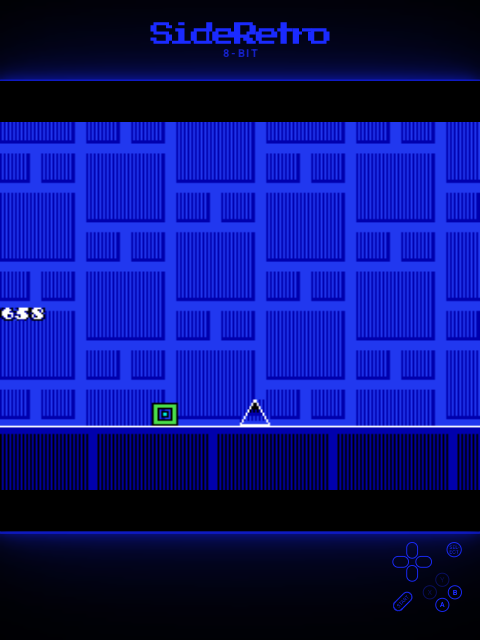
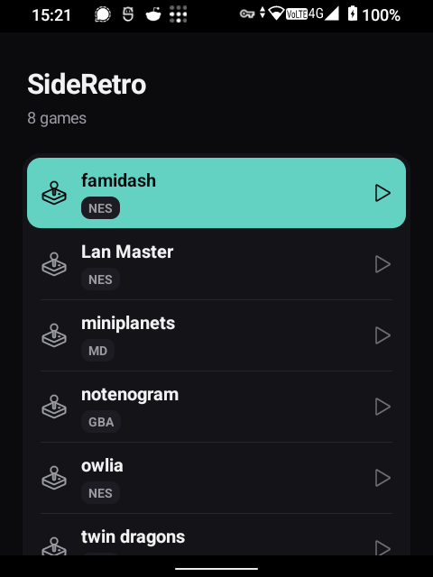

<p align="center">
  
</p>

# SideRetro

**A retro emulator for every Keytile, purpose-built for the [Sidephone SP-01](https://sidephone.com).**

<p align="center">
  <a href="https://github.com/sponsors/oliverpalonkorp"></a>
  &nbsp;
  <a href="https://sidesuite.app/sideretro"></a>
  &nbsp;
  
</p>

<p align="center">
  Part of the open-source SideSuite for the SP-01 — see
  <a href="https://sidesuite.app">sidesuite.app</a>, or install the suite from the
  <a href="#install">SideSuite app pack</a>.
</p>

The SP-01 is a small Android feature phone with interchangeable physical Keytiles. Most emulators
assume a touchscreen or one fixed gamepad; SideRetro starts from the opposite premise. It is designed
first for the Mini Controller Keypad: its D-pad and labelled face buttons make it the clearest,
most direct way to play. Compact QWERTY, T9, Classic, and Sundial remain playable without a profile
picker or on-screen controls; their controller maps are purposeful adaptations of their own keys.

The legend in the lower corner mirrors the tile in your hand. It identifies the tile passively from
the keys you press, shows what each useful key does in the current system, and lights the physical
button as you press it. The game stays primary: pixel-sharp, full-screen, and free of touch controls.

SideRetro plays **Game Boy, Game Boy Color, Game Boy Advance, NES, and Mega Drive / Genesis** games.
It does not include, fetch, or link to commercial games; bring legally obtained ROMs through the
Android picker, sharing, or “open with.” Plain ROM files and single-ROM ZIP downloads both work.

<p align="center">
  
  &nbsp;&nbsp;
  
</p>
<p align="center"><em>Lit mode: makes the rest of the screen glow like an old CRT.</em></p>

## Contents

- [What it does](#what-it-does)
- [The rest of the screen lives with the game](#the-rest-of-the-screen-lives-with-the-game)
- [Controls and Keytiles](#controls-and-keytiles)
- [Adding and managing games](#adding-and-managing-games)
- [Display and saves](#display-and-saves)
- [Install](#install)
- [Privacy and permissions](#privacy-and-permissions)
- [Status](#status)
- [For developers](#for-developers)
- [License](#license)
- [Support](#support)
- [Credits](#credits)

## What it does

- **Five systems, three focused cores.** mGBA handles GB, GBC, and GBA; FCEUmm handles NES;
  ClownMDEmu handles three-button Mega Drive / Genesis games.
- **A controller map for every Keytile.** The Mini Controller is the intended, most direct fit;
  Compact QWERTY, T9, Classic, and Sundial are playable adaptations built from the union of their
  real Android keycodes.
- **A live physical legend.** The miniature tile shows game roles rather than making you translate
  `J`, `9`, or a media key in your head. Held controls use the same teal interaction colour as the
  rest of SideSuite.
- **No touch controls over the game.** Tap the screen to reveal a hidden legend; long-press it for
  the game menu.
- **Portrait, landscape, or automatic orientation.** Direction input rotates with the display.
- **Save states and invisible resume.** Quick-save and quick-load are available from the menu, and
  leaving a game preserves where you were.
- **A screen-lit faceplate.** Lit mode samples the running game and lets its brightest colour spill
  into the frame, wordmark, and legend. Lit with the CRT filter is the default.

## The rest of the screen lives with the game

Most portrait emulators put a game in a rectangle and leave the rest of the phone as dead
letterboxing. SideRetro's default **Lit** frame treats that unused glass as part of the machine.

The running frame is sampled continuously. Its brightest useful colour becomes a broad, soft cast
around the picture, then carries through the SideRetro wordmark and every pale line of the physical
Keytile legend. A blue game makes a blue console; a star field throws violet into the controls; a
warm scene can pull the whole faceplate toward amber. Button presses stay SideSuite teal, so live
input remains readable without breaking the game's light.

It is deliberately not a fixed theme or a coloured border. The surrounding screen changes because
the game changed—as if the picture were emitting into the rest of the device. Turn Frame to
**Console** for a quieter system-specific faceplate, or **Off** for pure black letterboxing.

## Controls and Keytiles

SideRetro is designed first for the Mini Controller Keypad. Its physical D-pad and labelled
A/B/X/Y controls make the legend a direct map of the controller in your hand. Compact QWERTY, T9,
Classic, and Sundial are supported adaptations: the same games remain playable, but their denser or
less game-shaped keys naturally make their legends less direct.

SideRetro learns the attached tile from ordinary keypresses; there is no detection permission or
tile setting. Mini Controller, Compact QWERTY, and Sundial identify immediately. T9 and Classic emit
the same numpad keycodes, so they intentionally share the T9 legend—the Classic tile's additional
D-pad, Enter, and Delete controls still work even though that extra hardware is not pictured.

The menu follows the labels physically printed on the tile rather than any rotated in-game mapping.
That means a named D-pad direction remains that direction in menus, and Mini Controller A confirms
while B goes back.

Two display orientations for face buttons are available in landscape:

- **Labels fixed** keeps A/B/X/Y attached to their printed names.
- **Positions fixed** keeps their physical thumb positions attached to the rotated game.

The legend always reflects the active choice.

## Adding and managing games

Choose **Add games** in the library, share a supported file to SideRetro, or open a browser download
with SideRetro. Recognised extensions are `.gb`, `.gbc`, `.gba`, `.nes`, `.md`, `.gen`, `.smd`, and
`.zip`.

A ZIP must contain exactly one supported ROM. SideRetro ignores common archive metadata, rejects
ambiguous or unsafe archives, and extracts only into its private library. Imported games can be
deleted by long-pressing a game or pressing Right on its selected row; SideRetro confirms first and removes that game's save states and
in-game save data. The original download remains untouched.

<p align="center">
  
</p>
<p align="center"><em>The library shown with freely distributable homebrew games.</em></p>

## Display and saves

The default **Sharp** scale preserves the console's pixels. **Large** uses more of the panel while
keeping the picture's aspect ratio, and **Fill** stretches it to the whole screen. The filter setting
is deliberately just **Off** or **CRT**—the other bundled shader experiments did not survive testing
at the SP-01's portrait scale.

Frame choices are **Off**, **Console**, and **Lit**. Lit is the default. Save states, battery-backed
save RAM, and automatic resume are stored privately on the phone alongside the imported copy of the
game.

## Install

Two ways in. Both install the same signed app once SideRetro reaches its first public release.

### On a Sidephone SP-01: the App Pack

The SP-01's **Library** can add extra sources, called app packs. From the SideSuite pack, SideRetro
installs without an “unknown sources” warning and receives updates through the system Library.

<p align="center"></p>

1. Open **Library → Settings → App Packs → +**, then scan the code above or enter
   `https://fdroid.sidesuite.app/fdroid/repo`.
2. Check that the displayed fingerprint is:

   ```text
   61FD7A8F0D32925EE80C7F55A6690C2A02C2FC3CA9C678370BF623EAB29870A0
   ```

3. Install **SideRetro** from the Library.

### Anywhere else: Releases

Download `app-release.apk` from
[Releases](https://github.com/side-suite/SideRetro/releases), copy it to the phone and open it, or
install over USB:

```bash
adb install -r app-release.apk
```

SideRetro requires Android 12 (API 31) and is built for `arm64-v8a`.

## Privacy and permissions

SideRetro declares **no Android permissions**. It has no advertising, analytics, accounts, or
network feature.

- Games enter only through an explicit Android picker, share, or “open with” action.
- ROMs, preferences, save states, and save RAM remain on the device.
- SideRetro cannot browse arbitrary storage and cannot upload anything.
- Deleting an imported game never deletes the browser download or another external original.

## Status

SideRetro is preparing for its first public release, version 1.0. The app and all five systems run on
the SP-01, physical-tile qualification is complete, and the production-signed APK plus corresponding
source archive are assembled. The remaining work is publishing the coordinated GitHub, SideSuite,
and App Pack/F-Droid release.

Exact core revisions and binary hashes are recorded in
[`THIRD_PARTY_SOURCES.md`](THIRD_PARTY_SOURCES.md) and
[`CORE_SHA256SUMS`](CORE_SHA256SUMS). The public release procedure is in
[`RELEASE.md`](RELEASE.md).

## For developers

SideRetro is a Kotlin Android app using LibretroDroid. The Android project lives in [`app/`](app/)
and requires JDK 21 plus Android SDK API 36:

```bash
cd app
export JAVA_HOME=/usr/local/opt/openjdk@21
./gradlew :app:testDebugUnitTest :app:assembleDebug
```

Architecture, device commands, and the input model are documented in
[`DEVELOPING.md`](DEVELOPING.md); the product and interaction decisions live in
[`SPEC.md`](SPEC.md).

## License

SideRetro is licensed under the [GNU General Public License, version 3](LICENSE). Dependency and
core licences, attributions, and provenance are collected in
[`THIRD_PARTY_NOTICES.md`](THIRD_PARTY_NOTICES.md) and
[`THIRD_PARTY_SOURCES.md`](THIRD_PARTY_SOURCES.md).

## Support

If SideRetro is useful to you, you can support continued SideSuite work through
[GitHub Sponsors](https://github.com/sponsors/oliverpalonkorp). Bugs and hardware-specific findings
belong in this repository's issue tracker.

## Credits

SideRetro is built on [LibretroDroid](https://github.com/Swordfish90/LibretroDroid),
[mGBA](https://mgba.io), [FCEUmm](https://github.com/libretro/libretro-fceumm), and
[ClownMDEmu](https://github.com/Clownacy/clownmdemu-libretro). Interface icons come from
[Iconoir](https://iconoir.com). SideRetro and the rest of SideSuite are made for the Sidephone SP-01.
